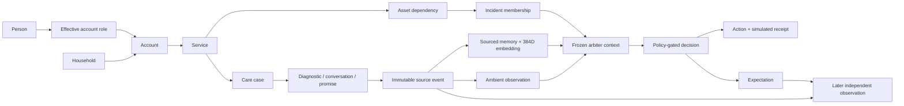

# BT household data foundation

The app now has a dedicated hosted Supabase model, **bt-experience-intelligence**, in **ACN-RX-GeekOut**, London. The private project is [imvupiejuuyczrrwsnuy](https://supabase.com/dashboard/project/imvupiejuuyczrrwsnuy). No Docker is used.

## What is in the dataset

The reproducible `bt-households-v1.1` fixture contains **three households, four people, three accounts, four services and 2,827 source observations**. The fourth person is an unauthorised household member, retained as an access-boundary test. Maya's mobile service is explicitly linked to her account; it cannot establish broadband health.

- Daniel: previous resolved case, current care chat, follow-up conversation, diagnostic attempts, Aisha's promise, a reserved callback slot, network scope, technical restoration and a separate customer reply.
- Sam: order acceptance, dispatch, delivery, pending provisioning and an actual setup conversation. Broadband first use remains unobserved.
- Maya: 182 overnight windows, observed gap/return records and a quoted preference. The most recent 28 windows contain 26 observed returns and two incomplete observations. Interval summaries use the same gap timeline. No cause is inferred from missing telemetry.

[Canonical manifest](../fixtures/bt-households/v1/canonical-manifest.json) records the seed, content hash and exact table/event counts. The previous v1 dataset remains immutable in the database. Eight independent variants exercise late diagnostics, duplicate delivery, corrected scope, contact withdrawal, slot contention, missed callbacks, self-reported gaming interest and failure after apparent recovery.

## Relationships



The five private schemas separate customer identity/authority, operational records, ingestion, derived memory and runtime execution. Composite session foreign keys prevent cross-session joins. Additional constraints prevent cross-service case references, backdated/cross-subject corrections and memories borrowing another service's evidence. Source events are append-only; a correction is another row.

`occurred_at` is the simulated event time, `known_at` is its simulated arrival, and `ingested_at` is the actual import timestamp. Both event and knowledge times constrain a replay. Current projection rows are not used to reconstruct past decisions.

## Memory and execution

The common context builder checks the person → account-role → service relationship before reading memories. It derives episode text from actual messages and diagnostics, and calculates the overnight numerator and denominator from records. Each memory records its epistemic status, evidence IDs, availability, content hash and derivation version.

The BT-owned local MiniLM encoder produces real 384-dimensional vectors. The [encoder manifest](../fixtures/bt-households/v1/encoder-manifest.json) pins every model artifact by SHA-256. Authority/service/time filtering happens before cosine ranking. The exact admitted/rejected manifest and model request are persisted with the assessment. If the encoder is unavailable, the context explicitly uses bounded structured memory without semantic scores.

The customer atlas uses these episode vectors and actual source descriptions. Its PCA axes are geometric. A small household history produces a small map; no extra points are fabricated. The separate visual lab remains an explicitly labelled example corpus.

Postgres stores narrow ambient flags, durable provider attempts, decisions, intended expression, rendered messages, simulated receipts, expectations and subsequent checks. The same arbitration policy is used by SQLite and Postgres. Worker leases, revision checks and unique logical-action keys prevent competing commits and duplicate delivery. A started model attempt is not automatically rebilled after a crash.

Eve reads the same scoped household state. Server-verified text exchanges are retained as messages, with actual execution times and the inspected replay cutoff. They are never backdated into historical assessments. Live voice still uses its existing client transcript; server-side durable voice-transcript ingestion is not included in this milestone.

## How this supports Mark's pitch

| Pitch point | What can be demonstrated | What is not claimed |
|---|---|---|
| First seven days | Sam's delivery, provisioning and first-use stages are separate | A delivered message is not successful onboarding |
| The silent router | Maya's personal baseline is recalculated and fresh evidence can override it | A prediction of tonight's return or prevented-call savings |
| Remember the relationship | Daniel's original chat, failed diagnostic and named promise survive handover | Invented emotion, satisfaction or churn scores |
| One relationship | Explicit account linkage to a second product; household membership grants no access | Real BT/EE cross-brand integration |
| Safe action | Frozen context, policy gates, durable attempts, independent receipt and outcome checks | Production deployment or actual customer contact |
| Learning loop | Completed context/action/wording pairs and separate outcome observations | A trained bandit, causal uplift or population forecast |

## Running and verifying

```sh
npm --prefix app ci
node scripts/setup-bt-encoder.mjs
npm --prefix app run dev
```

`app/.env.database.local` is ignored and contains server-only credentials. It is separate from the existing AI-key file. `BT_STORAGE=supabase` selects hosted storage; `BT_STORAGE=sqlite` restores the existing local database. The local backend remains localhost-only. The Vercel presenter accepts same-origin requests and requires RX Vercel authentication. Browser roles have no domain grants; the private presenter role cannot read `auth.users` or delete source events. This is a presenter boundary, not customer-facing account authentication.

For a fresh installation, link the dedicated project, apply the numbered migrations, and run `scripts/configure-bt-database.ts` using an administrative connection only for provisioning. The app itself uses the bounded `bt_runtime` login. Never put the database URL in a Vite variable.

```sh
node scripts/generate-bt-history.ts
node scripts/import-bt-history.ts canonical <session-uuid>
node scripts/check-hosted-schema.mjs
npm --prefix app test
BT_HOSTED_TESTS=1 node --test app/tests/repository-contract.test.ts app/tests/hosted-integrity.test.ts
npm --prefix app run test:lab
npm --prefix app run build
```

Generation is deterministic; imports are atomic and repeat imports insert zero observations. Conflicting fixture versions are rejected; validation failures are quarantined under ignored local data. Hosted tests explicitly opt in and use rules/recorded data, with no paid model calls. `BT_ARBITER_MODE=rules` runs a rules-only presenter; otherwise the configured gateway enables Jev. `BT_DISABLE_WORKER=1` is available for read-only inspection and isolated worker tests.

Existing SQLite sessions are retained. Optional controlled-evaluation artefacts remain in a separate local SQLite cache; hosted business records are not dual-written. Copying the hosted project alone does not transfer that evaluation cache or local model files.

## Hosted presenter

The Vercel project is `bt-experience-intelligence` in `acn-rx-geek-out`, with Node 24 and London execution next to Supabase. All deployment URLs require RX Vercel authentication. Only the bounded database connection and existing AI keys are configured as server-only sensitive environment variables.

Hosted requests resume durable jobs using Vercel `waitUntil`; no permanent timer is assumed. MiniLM files are fetched and SHA-256 verified during the build. The interactive customer/action projections use real PCA/SVD in Node; the hosted post-run map uses Node density contours and labels its method. Native Python Hodoscope export and controlled evaluation batches remain local because their current SQLite/Python artefacts are not durable in serverless storage. Existing local Hodoscope functionality is preserved.

Verification: 74 local tests pass, three hosted tests opt in separately; full hosted parity passed all five revisions (15 decisions), idempotent replay and reopen. Hosted lease/privilege checks passed. Frontend build and lab corpus checks passed. Cross-service failures cannot contradict an unrelated service outcome.

Final review corrected delayed permission withdrawal, incident membership tied to the exact service, and historical context hashes changing after future Eve messages. Regression tests failed before each fix and now pass. A hosted interruption test confirms recovery without another provider call after an Eve exchange; service-scoped outcomes also reject unrelated product incidents.

Deployment smoke checks: protected HTTP access, health/configuration, historical snapshot, real 384D customer atlas, 15-run post-execution map, new dataset session creation, and the actual BT PNG asset. The browser in this session reaches RX's Vercel login; HTTP checks use the authenticated owner CLI. Native voice and paid model quality are not asserted by those checks.
