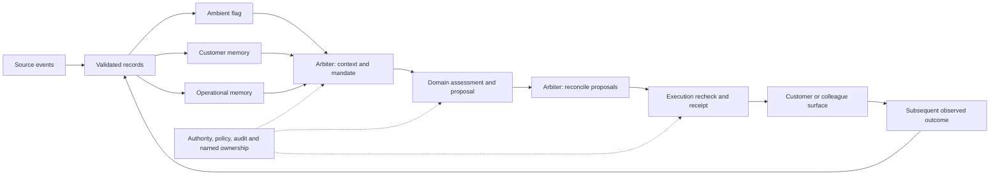
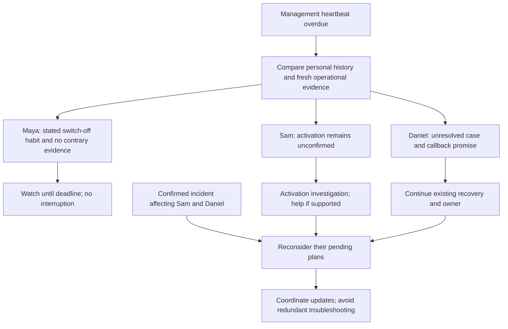
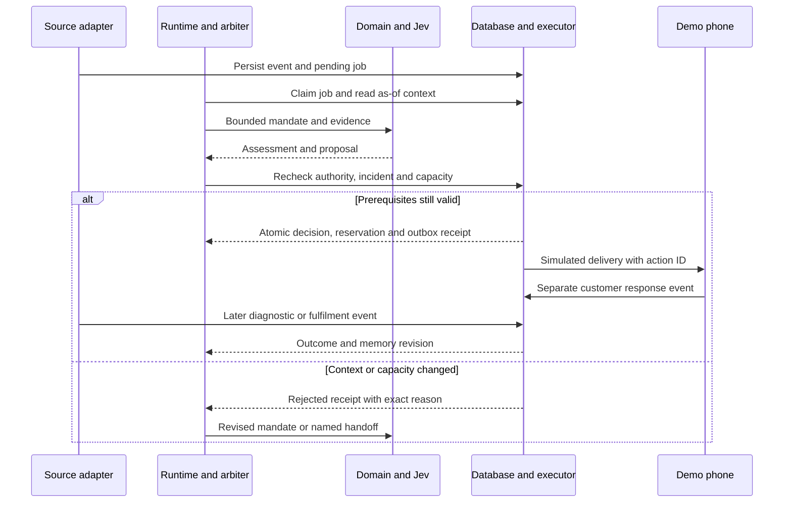
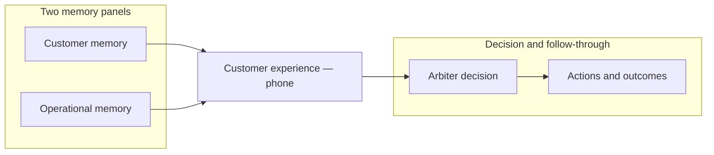

# Mark's pitch → experience → technical proof

25 September 2026. Source: the supplied [BT Consumer: Proposal Narrative](../source/marks-bt-consumer-pitch.txt), referred to by the user as Mark's pitch. The source is preserved verbatim. This document separates its argument from our design response and from facts still requiring validation.

Open the [visual review](review.html) alongside this mapping. The [full specification](../superpowers/specs/2026-09-25-bt-consumer-experience-design.md) remains the detailed behavioural contract. Mockups illustrate proposed states; they do not claim that the backend exists.

## The argument we carry through

**Mark's argument:** the quality of the customer relationship increasingly depends on what BT remembers, how it interprets a moment, and whether it can act and follow through. The design turns that into one inspectable loop. Operational memory strengthens the proposal by showing the system what is happening across the service estate and what the organisation can deliver now.

We retain the sequence of the pitch: changing expectations → specific customer moments → connected architecture → accountable delivery. The demo starts at the customer moment, then reveals the architecture. The commercial discussion follows demonstrated outcomes.

## Traceability matrix

All implementation status below is **specified / mocked**, not built for BT. IDs are shared with the visual review so comments can refer to an exact argument.

| ID · point from Mark | How we fold it in | Where it becomes visible | Technical proof required |
| --- | --- | --- | --- |
| **M01 · The relationship around the connection matters** · §1 | Show a response shaped by the existing relationship; retain network quality as important | Compare Maya, Sam and Daniel after the same event class | Different decisions from different evidence snapshots; no unsupported differentiation or churn claim |
| **M02 · Customers expect the company to remember** · §1 | Carry attempted fixes, preferences, owner and promises across a new interaction | Daniel's phone says what happens next; the customer-memory panel shows earlier attempts | Existing case and pending-action ownership survive channel changes and ambient events |
| **M03 · Some friction should disappear; some moments need a human** · §1 | Automatic observation and routine checks; named human continuity for unresolved recovery | Maya is undisturbed; Daniel keeps his callback owner | Policy decides the automation boundary; human route and promise remain actionable |
| **M04 · Personalisation depends on trust and explanation** · §1 | Provide short customer explanations and inspectable source evidence at the right depth | Customer “Why this update”; presenter evidence drawer | Valid subject access, purpose restrictions, freshness, decision record and correction trail |
| **M05 · The first seven days** · §2, moment 1 | Treat missing activation confirmation as an investigation trigger | Sam's service setup view, distinct from delivered equipment | Order delivery, provisioning, activation and successful-use observations are separate events |
| **M06 · The silent router is not always a problem** · §2, moment 2 | Same heartbeat class, different contexts and response; explicitly show unknown diagnostics | Three-household comparison and personal baseline | Missing heartbeat is not equated to zero traffic, power-off or confirmed line failure |
| **M07 · Proactive should not become noise** · §2, moment 3 | A hold is a first-class decision with a deadline; merge updates and suppress conflicts | Maya's quiet phone; held commercial alternative on Daniel | Contact coordination, deduplication, watch expiry and wake conditions |
| **M08 · One household, several products, one relationship** · §2, moment 4 | Use one verified household/service view in the first build | Service context and later relationship chapter | Typed identity and authority model. Cross-brand pooling remains a validated future boundary, not an assumed integration |
| **M09 · Customer memory has six layers** · §3, component 1 | Translate identity, behaviour, service, context, expressed emotion and intention into evidenced records | Memory lanes with stated/observed/derived markers | Source links, validity, confidence where meaningful, correction and supersession; no permanent emotional score |
| **M10 · A reasoning and planning engine chooses what to do** · §3, component 2 | Ambient flags; arbiter considers both memories; domains assess bounded tasks | Clear decision, alternatives and Jev questions | Typed assessment plus deterministic policy, context version and owner; no mystery aggregate score |
| **M11 · A decision must become governed action** · §3, component 3 | Recheck capacity and authority before committing; persist a receipt | A competing slot allocation visibly blocks a stale plan | Transactional constraints, idempotency, rejection receipts and a genuine demo outbox |
| **M12 · Close the learning loop** · §3, component 4 | Distinguish offered help, observed restoration, confirmation and fulfilment | Outcome rail and memory before/after | Later events change memory; matured cohorts and backtested models, not a “learning” animation |
| **M13 · Governance belongs throughout the architecture** · §3, component 5 | Policy and authority attach to every decision/action instead of a final compliance slide | Evidence and action inspector | Access scope, policy version, human ownership, failure behaviour and audit data |
| **M14 · One partner holds the whole system together** · §4 | Demonstrate the connected moment, data, decision, action and outcome in one story | Customer/operational memory → centred phone → arbiter and outcomes | Shared case/run IDs and end-to-end evidence; Accenture attribution follows the demonstration |

## What our earlier work adds

| Addition | Why it improves Mark's pitch | Provenance |
| --- | --- | --- |
| **Operational memory beside customer memory** | A well-informed customer response also needs incident scope, tool health, capacity and current commitments | Sainsbury's store state, Soho House state and the user's repeated request to make this tangible |
| **Ambient / arbiter / domain distinction** | One signal does not contain enough context to choose the overall action | Jio's event-driven architecture; the user's specific correction in Soho |
| **A withheld action as a visible success** | Makes thoughtful personalisation observable even when the customer receives nothing | Jio contact arbitration and Soho workbench feedback |
| **Typed model judgements** | Makes ambiguity and criteria visible without disguising a policy rule as an AI probability | Jev references supplied by the user and the real Soho Gateway experiment |
| **A forecast tied to capacity** | Shows what operational history lets the business prepare for, as well as explain retrospectively | Soho conditional forecasts; Sainsbury's demand/capacity concept, strengthened with fitted models and validation |
| **Relevant expansion of the relationship** | Connects service value to later product adoption and paid continuation | Soho category discovery and the user's instruction to track future paid engagement |
| **Five panels with full-page drilldowns** | Keeps the customer central while the two memories, arbiter and outcomes remain one click from their evidence | User-requested pre-Studio Jio account pattern; April Jio typography and panel treatment |

These are proposed extensions. We should not attribute them to Mark as though he specified Jev, Supabase, these screens or these particular agent boundaries.

## Diagram 1 · One connected architecture

This is the proposed logical architecture, not a deployment diagram. Governance applies across it; the rail is not another agent that runs at the end.

**Read this as:** notice → understand → decide → act → establish what actually happened. The source-to-memory edge is a projection; the outcome-to-record edge needs a new observation.

## Diagram 2 · Same event, three responses

**What changes the answer:** evidence of an incident and explicit affected-service membership. The system does not assume Maya is unaffected merely because of her past habit.

## Diagram 3 · Why a committed action needs more than a model answer

**What this proves in the eventual build:** model completion, action commitment, delivery and successful resolution are different events. The current visual review only illustrates them.

## Mock UI/UX review

The [browser review](review.html) includes three connected views and an argument map:

| View | What to look at first | Interaction to critique | Mark references |
| --- | --- | --- | --- |
| **Experience** | Customer phone and the plain-language consequence | Select Maya/Sam/Daniel; open any of the five panels as a full page; add the incident | M02, M03, M05, M06, M07 |
| **Operations** | Affected-service context, then callbacks due versus slots remaining | Select the same customer; see the service evidence and named promise together | M10, M11, M12 plus our operational-memory extension |
| **System** | Signal through the decision loop; two memory sources feed the arbiter | Follow the linked responsibilities rather than a wall of agent cards | M09–M14 |
| **Pitch map** | Mark's point next to a proposed on-screen proof | Jump back to the relevant view | M01–M14 |

Review the screen in this order: **moment → decisive evidence → decision → consequence → deeper records**. We preserve BT's mark/indigo while carrying over the best Jio/Soho interaction patterns. The mock carries forward the pre-Studio Jio system-sans/monospace stacks, warm surfaces and fine dividers, with BT purple accents. Licensed BT Curve has not been supplied.

Current mock scope: authored illustrative phone copy and operational figures; URL-backed household/view/panel selection; incident-state comparison; five full-page breakdowns; source/decision inspector. No model probabilities, forecasts or database receipts are invented as completed live work. Buttons explain their mock effect and backend boundaries.

## Claims we soften or hold out of the demonstration

- “Network and price have stopped differentiating” becomes a more defensible argument about delivering the relationship value of network investment.
- “BT already has every router signal” becomes a source contract to validate. Missing management telemetry, line state and usage are distinct.
- A multi-brand household is a possible extension dependent on authority and actual identity links; brand ownership alone is insufficient.
- The source's market statistics, research percentages and legal interpretation remain in the source document for validation. They do not become UI metrics or established premises.
- A self-learning architecture means observable outcomes, versioned memory and evaluated model updates. It does not mean uncontrolled policy rewriting.
- Actual incremental commercial impact needs an experiment. A synthetic demo can show the measurement design and traceable counts.

## What to decide in the review

1. Whether the three-household comparison is the right opening for the CEO audience.
2. Whether the five-panel overview gives each responsibility the right weight; all five expand to dedicated breakdowns.
3. Whether the operational view explains the wider context before showing the forecast.
4. Which of Mark's moments becomes the first validated BT use case after the pitch.

These are design choices for critique, not blockers to the document move or completion of the current design pack.

## Diagram 4 · Five-panel experience and drilldown

This diagram describes **screen positions**, not the execution order. The execution sequence remains in Diagram 3. Each of the five panels opens a full-page breakdown; household and incident state survive the transition and browser navigation. No model rerun is implied by a view change.

Visual provenance: Jio `ee83558b` (21 April 2026), before the June Signals Studio changes. Borrow its compact sans/mono hierarchy, warm paper, hairline dividers and quiet panel shadows. Adapt the user's two-left/two-right phone composition with BT identity and purple selection/decision accents. The source was inspected read-only; no Jio runtime was moved into BT.

## Confirmed fidelity reference · July Jio account screen

Following the historical preview, the user confirmed Jio `621fa991` (9 July 2026) as the desired level of fidelity. Apply its compact section labels, aligned attribute rows, source IDs, small status tags and differentiated record/agent/log treatments. Keep the five-panel BT composition; omit the merged controls and Studio sections visible in the historical screen.

The overview now contains customer state and cited memory, a service/incident projection with capacity, an ambient signal with context checks and mandate, and an authored action trace with inspectable JSON. These remain linked to the same household and incident fixture. Technical detail comes from explicit data/state boundaries; explanatory copy belongs in the full-page breakdowns. There is no claimed live model or execution result.
